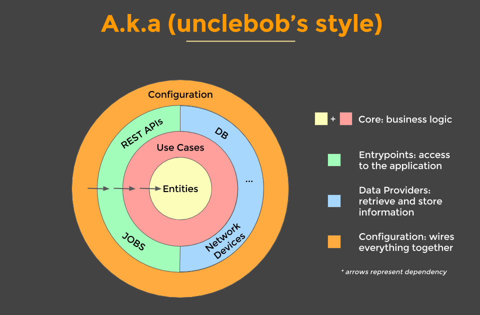

# MAHA Ecommerce Challenge

# Table of Contents
1. [Docker Image](#docker-image)
2. [Native build](#native-build)
3. [Architecture](#architecture)
4. [Discounts](#discounts)
5. [PreLoadedData](#preloaded-data)

## Docker Image

### Prerequisites

  * Docker
    
### Build Image
    docker build --tag mcabezas-api:0.1.0 .

### Run Image
    docker run --publish 9092:9092 --detach mcabezas-api:0.1.0

## Native build

### Prerequisites

  * Make
  * Golang 13+
  
### Build
    make

### Run
    ./api

## Architecture

This project has been built using `clean architecture`.

The database implementation is an in memory database. However, it can be easily replaced by another one once the database technology has been chosen.
 
### Why clean architecture?

* There is a huge separation of concerns between the business (use cases) and infrastructure (databases / cache / etc). 
  Use cases are the heart of the application because all the business logic lives there.

* Rest API is only a to expose the business over an HTTP protocol communication.

* It's very easy to implement other communication channels like Protocol Buffer or GraphQL without changing anything in the business logic.

* Infrastructure is only an implementation of third party components.

* Allow us to easily expand the api over microservices or contract us into a monolithic with no business changes.

### Discounts

The core functionality of this challenge belongs to the discount calculation.
It was decided by me to have a very flexible discount modeling using the `model.Discount` interface.

In this exercise I have created a `model.ComboDiscount` implementation of `model.Discount`.
Combo discount configuration comes from the `infrastructure.ComboDiscountRepository` providing an extra quote of flexibility.

## Preloaded Data

The application has two repositories

#### WatchCatalogueRepository

(Path cmd/web/rest/main.go:29)

WatchCatalogue comes preloaded with the following data
_________________________________________
| WATCH ID  | Name         | Unit Price |
|-----------|:-------------|:-----------|
|    001    | Rolex        |     100    |
|    002    | Michael Kors |      80    |
|    003    | Swatch       |      50    |
|    004    | Casio        |      30    |
-----------------------------------------

#### ComboDiscountRepository

( Path cmd/web/rest/main.go:21 )

ComboDiscountRepository comes preloaded with the following data
___________________________________
| WATCH ID  |  Unit | Fixed Price |
|-----------|:------|:------------|
|    001    |   3   |      200    |
|    002    |   2   |      120    |
-----------------------------------
